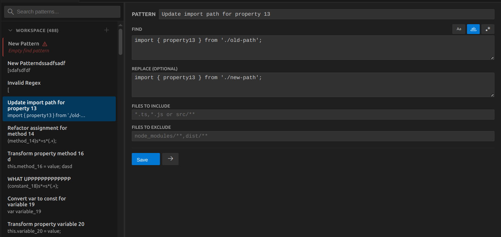

# PatternStore

Save and recall reusable **regex find/replace** pairs in VS Code.

## Features

**Load patterns** into Search panel with one keystroke

**Global & Workspace scopes** - Share or keep local

**Manage patterns** - Rename and delete via UI

## Quick Start

### Create Pattern
Either create one from the PatternStore Ui, or directly in setting.json. (See) `example-settings.json` for reference.

### Load a Pattern
1. Open PatternStore - Press `Ctrl+Alt+R` (or click gear icon in search panel)
2. Select a pattern
3. Click **→** to load into search panel

### Limitations
**Note** that directly creating a pattern from the vs-code search and replace panel is not possible due to API limitations. They need to be manually copied for now :/

## License

See LICENSE file.
